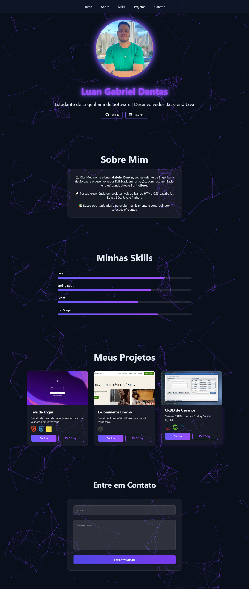

# 🚀 Portfólio - Luan Gabriel Dantas

Este é meu portfólio pessoal desenvolvido com foco em responsividade, organização de código e experiência do usuário.

O projeto apresenta minhas habilidades, tecnologias que utilizo e alguns dos meus principais projetos.
## 📸 Preview


---

## 🛠️ Tecnologias Utilizadas

- HTML5 (estrutura semântica)
- CSS3 (Flexbox, animações e responsividade)
- JavaScript (manipulação do DOM e menu hamburger)
- Font Awesome (ícones)
- Devicon (ícones de tecnologias)
- tsParticles (efeito visual de partículas)

---

## ✨ Funcionalidades

✔ Layout 100% responsivo  
✔ Menu Hamburger animado para dispositivos móveis  
✔ Animações suaves com CSS  
✔ Efeito visual moderno com partículas  
✔ Cards de projetos interativos  
✔ Formulário com envio via WhatsApp  
✔ Separação de responsabilidades (HTML, CSS e JS)

---

## 📂 Estrutura do Projeto
```bach
📁 portfolio
├── index.html
├── style.css
├── menu.js
├── contato.js
├── particles.js
└── 📁 img
```

---

## 📱 Responsividade

O projeto foi desenvolvido utilizando **media queries** para adaptação em:

- Desktop  
- Tablet  
- Smartphones  

---

## 🎯 Objetivo do Projeto

Este portfólio foi criado com o objetivo de:

- Consolidar meus conhecimentos em desenvolvimento Front-end  
- Demonstrar organização e boas práticas  
- Servir como vitrine profissional  
- Evoluir continuamente com novas funcionalidades  

---

## 🚀 Melhorias Futuras

- Integração com backend (Java + Spring Boot)  
- Tema claro/escuro dinâmico  
- Melhorias de acessibilidade  
- Otimização de performance  
- Deploy com domínio próprio  

---

## 👨‍💻 Autor

**Luan Gabriel Dantas**

🔗 LinkedIn: https://www.linkedin.com/in/luangabrieldev/  
💻 GitHub: https://github.com/LuanGabrielDEV  

---

⭐ Se gostou do projeto, considere deixar uma estrela no repositório!
